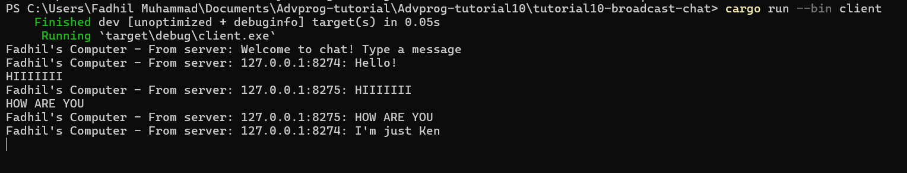

# Reflections

## 2.1. Original code of broadcast chat.

Untuk menjalankan server, kita jalankan `cargo run --bin server`. Untuk menjalankan klien, kita jalankan `cargo run --bin client`. Kita baru saja menerapkan komunikasi websocket antara server dan klien. Ketika klien mana pun mengirim pesan, pesan tersebut akan disiarkan ke semua klien. Kita dapat menjalankan beberapa klien dan melihat pesan-pesan yang disiarkan ke semua klien.

Server:

Client #1:

Client #2:

Client #3:

## 2.2. Modifying the websocket port

Jika kita melihat ke dalam `server.rs`, terlihat bahwa tidak perlu menginisiasi koneksi WebSocket karena perannya sebagai server. Server hanya perlu mengikat alamat dan menunggu koneksi yang masuk. Koneksi WebSocket diinisasi klien. Selanjutnya, server menerima koneksi yang masuk dan mengelola pesan-pesan yang disampaikan.

## 2.3. Small changes, add IP and Port

Server:

Client #1:

Client #2:

Di sini, kita menambahkan informasi mengenai port dari setiap pesan yang dikirim pada client (IP dan port nya).